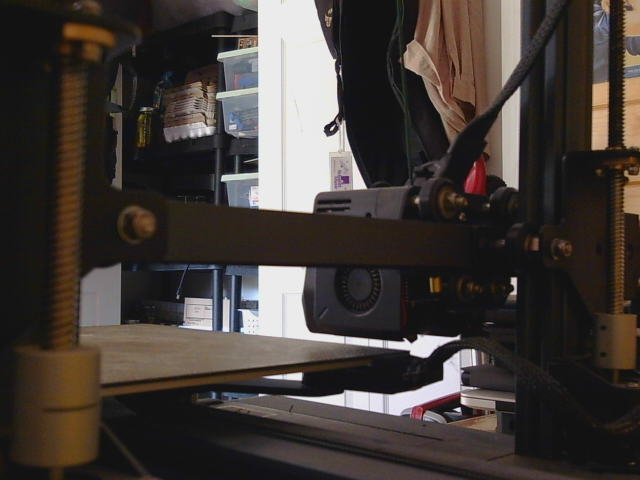
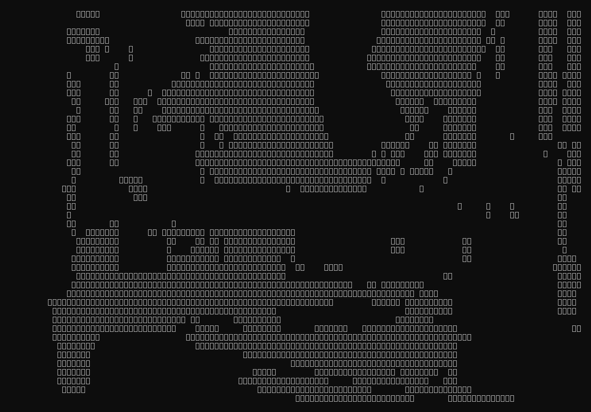

# Inline Images in Claude Code's Terminal CLI - 2026-08-21

## Context & Intent
This is a direct sequel to [ansi-escape-animation-attempt](ansi-escape-animation-attempt.md),
which established that Claude Code's chat *response text* isn't a raw terminal
passthrough — a markdown-rendering layer strips control characters before they
reach the terminal emulator. That test used synthetic escape codes as a probe. This
one asks the practical version of the same question with a real payload: can a live
photo — not characters, actual pixels — ever show up inline in a Claude Code chat
session run over SSH through a browser-based terminal (ttyd)?

The session started somewhere else entirely: reusing the [portfolio terminal
app](../showcases/portfolio/README.md)'s own chart-rendering code to paste a live
braille-rendered value chart straight into the chat, by importing the app's real
`fetch_chart_history`/`braille_chart` functions and running them against live data
instead of re-describing the numbers. That worked well and prompted the obvious
next question: if data can be pulled in like that, can a photo?

## Hypothesis
A 3D-printer webcam already streams to a local snapshot endpoint that a couple of
apps on the box use directly — the printer's own web dashboard, and a terminal app
(part of the same `boyoapps` family as the portfolio app) that renders a *live*
Sixel camera feed inside the exact same ttyd session, via `chafa --format=sixels`
piped through a tmux-passthrough envelope (tmux doesn't forward raw Sixel by
default, so every byte gets wrapped and every `ESC` doubled to survive the hop).

Working hypothesis: if a real terminal program in this exact session can already
render Sixel graphics live, then feeding Claude Code's own Bash tool the identical
`chafa` command and payload should produce the same result — same terminal, same
Sixel bytes, should be the same outcome.

## The Execution

**Attempt 1 — read and display the image directly.** Fetched a live JPEG from the
webcam's snapshot endpoint and displayed it via Claude Code's Read tool, which
loads image files as direct multimodal input — Claude can genuinely *see* the
photo this way. Reported back as if it had rendered inline. It hadn't: nothing
showed up in the human's actual ttyd terminal. Read-tool image loading is about
the model perceiving an image, not about the terminal displaying one — two
unrelated things that look similar from the assistant's side of the conversation.

**Attempt 2 — reproduce the boyoapps Sixel path by hand.** Ran
`chafa --format=sixels` against the same JPEG via the Bash tool, checked whether
the tmux-passthrough wrapper the printer app relies on was even reachable, and
found `$TMUX` empty in the Bash tool's own shell — it isn't attached to the human's
tmux session at all. More fundamentally: a Bash tool call's stdout comes back to
the assistant as a captured text result (visible, inspectable, sometimes even
truncated to a saved file above a size threshold), not written to the session's
pty the way a real foreground process's stdout is. There's no byte-level path from
a tool call to the human's actual terminal screen, independent of Sixel/tmux
specifics.

**Escalation — check whether this is ttyd-specific or universal.** Dispatched a
sub-agent to check Claude Code's own documentation and open issue tracker rather
than keep guessing from first principles. Confirmed via two open feature requests
that the terminal CLI has **no inline-image rendering at all, in any terminal,
regardless of graphics protocol** (Sixel, Kitty's APC-based protocol, iTerm2's OSC
1337) — this isn't a ttyd gap, a config issue, or something a cleverer escape
sequence would fix. The other Claude Code surfaces (IDE extension, desktop app,
web app) are GUI chat panels rather than terminals, so they aren't bound by the
same constraint in principle — but nothing in the docs confirms either way whether
they actually render images inline, so that's a real open question, not a "yes."

**The actual fallback — braille art.** Circled back to the exact technique the
portfolio app's chart renderer already uses: `chafa`'s braille symbol mode
(`--symbols=braille -c none`), which packs a 2×4 sub-pixel grid into a single
Unicode braille codepoint — 8× the resolution of one-character-per-pixel ASCII
art — and, critically, emits *plain printable Unicode text with zero escape
sequences*. That makes it immune to both chokepoints found above: it survives the
tool-output capture path fine (it's just text) and it survives the markdown
rendering layer fine (nothing to strip). Rendered the same webcam JPEG this way
and it displayed correctly, no tooling gap involved.

One real hiccup along the way, left in for honesty: the first attempt to paste the
120×60 braille render into the chat only actually included the first 15 of 45
generated rows — a copy/paste mistake composing the response, not a rendering or
truncation bug. Worth calling out because from the outside it initially looked
like more evidence of a platform limitation, when it was just an ordinary error.

**Timing, measured after the fact** (webcam snapshot fetch → `chafa` conversion):

| Step | Time |
|---|---|
| Fetch JPEG from the local snapshot endpoint | ~45ms |
| `chafa` braille-mode conversion | ~8ms |
| `chafa` sixel-mode conversion (boyoapps' own path, for comparison) | ~11ms |

The perceived "slowness" of the whole exercise had nothing to do with this pipeline
— all three steps are near-instant. The real bottleneck is almost certainly the
sheer text volume: a 120×60 braille render is on the order of 5,000+ multi-byte
Unicode characters generated as literal assistant output, which takes real time to
produce and stream regardless of how fast the conversion tool itself runs — plus
the self-inflicted repeat from the copy/paste miss above, which doubled the actual
output needed.

## Findings

- **Claude Code's terminal CLI cannot render real images inline, in any terminal,
  regardless of graphics protocol support.** Confirmed via the project's own open
  GitHub issues, not inferred — this rules the question out generally, not just
  for this specific ttyd session.
- **The cause is architectural, not a missing terminal capability.** The same ttyd
  session running the same tmux can and does render live Sixel graphics — proven
  by an ordinary foreground program (the printer terminal app) doing it
  successfully seconds before the failed attempt. What's actually missing is any
  path from a Claude Code tool call's output to the raw pty; every tool result
  round-trips through the harness as structured/captured data first.
- **Two independent chokepoints confirm the same underlying rule**, one from each
  side of a turn: the earlier ANSI-escape test showed the *response text* path
  strips raw control bytes via markdown rendering; this test shows the *tool
  output* path never reaches the pty at all. Neither the harness's input side nor
  its output side is a raw terminal passthrough.
- **Braille-symbol art sidesteps both chokepoints entirely**, because it needs no
  escape sequence in either direction — it's the same reason the portfolio app's
  own chart renderer already uses it for line charts, now validated against a real
  photograph instead of a data series.
- **The actual bottleneck was text volume, not tooling** — the conversion pipeline
  itself measured under 60ms end-to-end; generating and streaming several thousand
  characters of dense Unicode output is what took real time.

## Conclusion / What Actually Works

Real image pixels inline, from a Claude Code terminal session: no, and not
fixable from this side — confirmed as a platform-level gap, not an environment
quirk. Whether the IDE extension, desktop app, or web app render images inline is
still genuinely unconfirmed and would need testing directly on one of those
surfaces.

High-fidelity Unicode/braille art, reusing the exact rendering technique the
portfolio app already validated for charts: yes, with a real tradeoff attached.
**It's inefficient, not because the image pipeline is slow (see the timing table
above — the whole fetch-and-convert step is under 60ms), but because producing
and streaming a render this dense as literal assistant text output takes real
time on every single request.** Set against that: the image quality it actually
delivers is genuinely usable — not a substitute for a real photograph, but good
enough to make out real detail at a glance, which is the bar that actually
matters for "did this tell me anything."

The subject is the 3D printer's own bed and extruder carriage, viewed from the
webcam that already feeds the printer's own web dashboard. Here's the real photo
first, for direct comparison against the braille render below it:

And the same frame, converted (45 rows, `chafa --symbols=braille -c none
--size=120x60`) and rendered to a PNG (DejaVu Sans Mono, rasterized directly from
the character grid) rather than left as a raw Unicode text block — braille
codepoints are exactly the kind of thing that renders inconsistently across
viewers (font fallback, line-wrapping, mobile width) depending on what's
installed and how wide the viewport is. A screenshot pins the exact layout so it
looks the same everywhere, the same way the real photo above does:

Low-motion frame (idle print bed, nothing running), so most of the detail is the
printer's own frame and shelving rather than anything dynamic — but the extruder
carriage and bed edge read clearly, which is the actual bar for "is this useful
for a glance check," not photographic fidelity.
