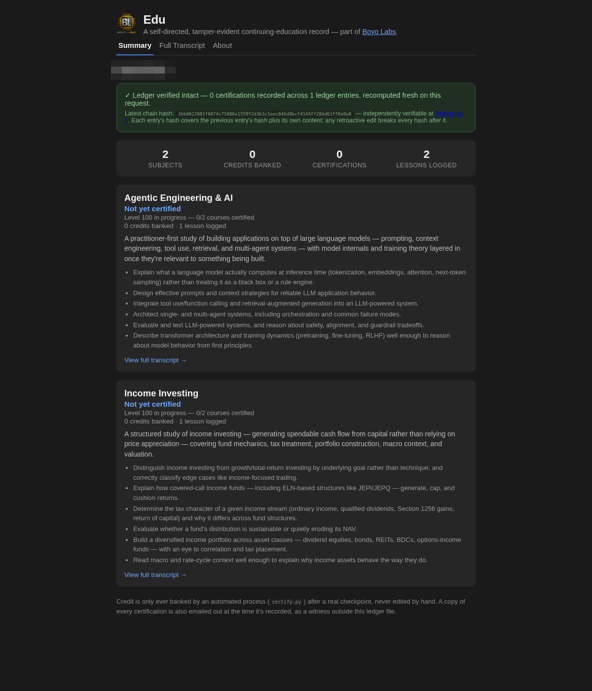
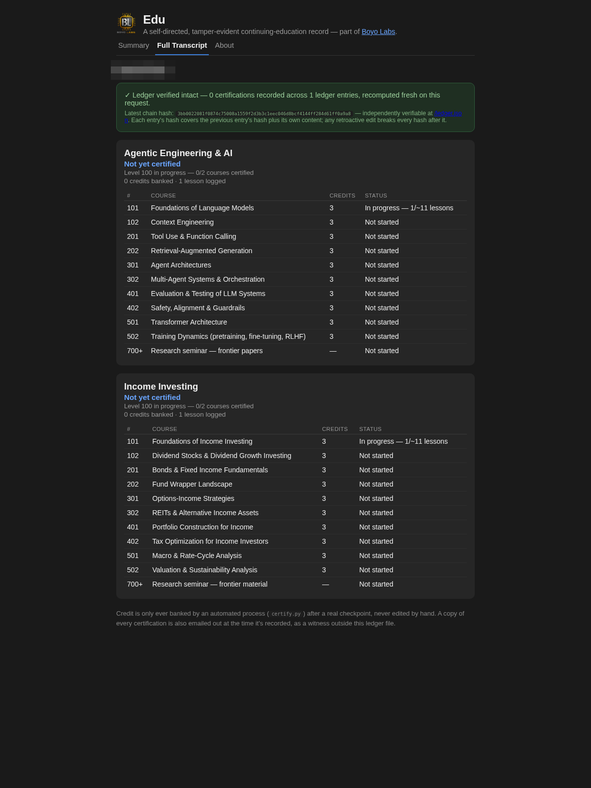

# Self-Directed Continuing Education System

## What it builds

A self-directed, college-structured continuing education tracker: one markdown
file per subject, course numbers that climb real university tiers (100s → 700s+)
over time, mastery-checkpoint assessment instead of per-lesson grading, a
tamper-evident SHA-256 hash-chained certification ledger, and a small public
read-only web app rendering it all live.

Live at: **[edu.boyolabstech.com](https://edu.boyolabstech.com)**




## Master Prompt

Paste this to an AI coding assistant (e.g. Claude) to have it build the same
system for you:

```
Set up a self-directed, college-structured continuing education system for me.

1. One markdown file per subject I want to study, each containing:
   - A Transcript table near the top: course number, title, credit hours, status (Not started / In progress -- N/~M lessons / Certified <date>).
   - A Scope section describing what the subject covers.
   - A Baseline section capturing what I already know coming in -- fill this in during our first real session on the subject, not up front.
   - A Lessons section: one dated entry per session (### YYYY-MM-DD -- Topic), each with Covered / Key concepts / Open questions-to-revisit.

2. Course numbering that climbs real university tiers over time with no final "done" state: 100s/200s (intro/intermediate undergrad) -> 300s/400s (advanced undergrad) -> 500s/600s (graduate) -> 700s+ (doctoral/research-seminar, reading real frontier material). A standard course is ~3 credits ~= 10-12 lessons, mirroring a real semester course.

3. Assessment by mastery checkpoint, not per-lesson grading: periodically (roughly the 10-12 lesson mark, only when the material genuinely warrants it) test whether I can explain/apply/synthesize the course material back in real conversation. Pass -> credit banks, we advance the course number. Not solid yet -> no penalty, we revisit the weak points later. No course is ever permanently closed to revisiting, even after credit banks.

4. A tamper-evident certification ledger: an append-only JSONL file where each entry's hash is SHA-256 of (previous entry's hash + this entry's own canonical JSON content). A certify.py script appends a new entry only after a real checkpoint pass, and a verify.py script walks the chain and reports exactly where it breaks if any past entry was altered. Certification is only ever triggered by you recording a checkpoint that was actually just passed in conversation -- never a form I fill in by hand. Email each new ledger entry to me at the moment it's recorded, as an external witness copy that isn't sitting in the same locally-editable folder as the rest of the system.

5. A small public read-only web app (e.g. Flask) that renders this ledger and the subject files live from disk on every request -- never caching the integrity check. Genuinely public, no login/PIN at all -- a transcript only proves anything if someone besides me can look at it. Three tabs:
   - Summary: overall stat tiles (subjects, total credits, total certifications, total lessons logged) plus one card per subject showing its level, credits, lesson count, and a link to the full transcript.
   - Full Transcript: the complete per-subject course catalog, one row per course, each certified row showing its own individual ledger-entry hash (not just a page-level claim).
   - About: explains the system, the level table below, and why the hash chain exists -- plus a copy of this very prompt in a copy-pasteable block, so anyone else can bootstrap the same system for themselves. Recursive on purpose.
   The official credential is the numeric level itself (Level 100, Level 200, ...), awarded only once EVERY course in that numeric bracket is certified, not just the highest one reached -- with a small "roughly equivalent to" description alongside it for context only: 100s -> Certificate-equivalent, 200s -> Associate-equivalent, 300s -> Advanced Undergraduate-equivalent, 400s -> Bachelor's-equivalent, 500s/600s -> Master's-equivalent, 700+ -> Doctoral/Research-equivalent (this last one open-ended, awarded as soon as anything at 700+ is certified since it's an ongoing research-seminar track that's never "complete"). While a level is incomplete, show a small progress line instead (e.g. "Level 100 in progress -- 1/2 courses certified").

6. When a Level newly completes, generate a diploma-style PDF certificate (landscape, branded, listing just that level's own bracket of courses -- not the full cumulative history, so it stays a bounded length -- with a bold "Hash Certified Signature" block filling the space below the course list) and email it separately from the existing per-course witness email, on top of it rather than replacing it. Also serve these certificates on the web app itself, at a route that recomputes the achieved level fresh from the live ledger on every request and only serves the PDF if that exact level is genuinely achieved (404 otherwise) -- with the Level text on the site linking directly to it.

7. A prominent byline near the top of every page with my actual name, so it's unambiguous whose record this is -- not just a project title.

8. When I ask for a lesson, actually teach it as real back-and-forth conversation -- don't dump a written lecture. Bring material, let me push on it, work through misunderstandings together, and only log/certify based on what genuinely happened in that conversation.

Be upfront that this is tamper-evident, not tamper-proof: real friction against casual self-editing and a verifiable audit trail, not a cryptographic guarantee against someone with root access to the machine it runs on.
```

## Notes

- Replace step 7's "my actual name" with whatever name/byline you want on your
  own instance — the screenshots above have the original name redacted.
- Built with Claude Code against a Flask backend; any capable AI coding
  assistant should be able to follow this prompt regardless of stack.
