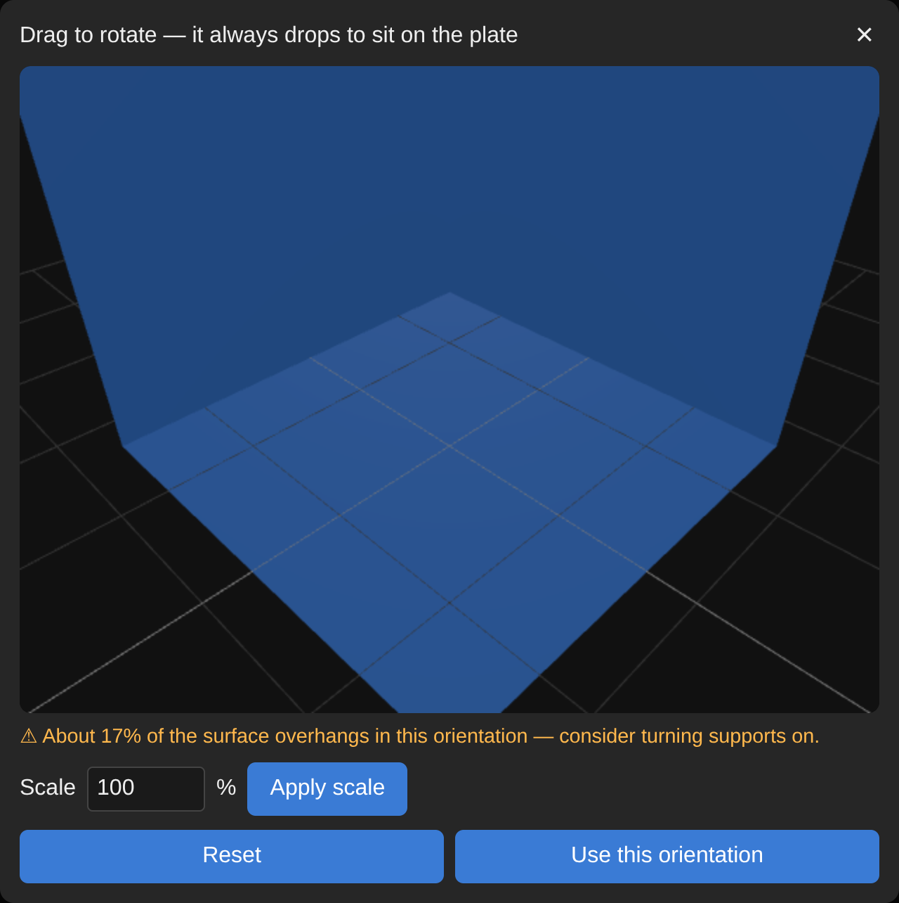

# Building a Slicer Into a Browser Upload: Auto-Orientation, Infill, Tree Supports, and the Silent-Default Bugs Underneath

**Date:** 2026-08-13

## Context & Intent

The print queue app's upload flow doesn't hand a file to a real slicer GUI and wait for a human to click through it — it *is* the slicer. Upload an STL, and a full pipeline runs headless in the background: orient the mesh, resolve a settings profile, feed it to a real slicing engine binary, and hand back an actual weight/time/price before anything is even queued. That means every piece of what a slicer normally does interactively — deciding which face touches the plate, centering, infill generation, support placement — has to happen in code, with no GUI's own internal logic standing behind it to catch mistakes.

This is a deep dive into how each of those pieces actually works, plus a real research finding that fell out of building it: running a GUI slicing engine through its plain command-line mode, instead of the richer protocol the real GUI talks to it with, causes an entire class of settings to *silently* resolve to the wrong value — never a crash, never a warning, just a plausible-looking but wrong output. That one failure shape caused three separate real print-quality problems before it was understood as one pattern rather than three unrelated bugs.

## The Pipeline, End to End

1. **Pick a file.** The moment an STL is chosen, it's parsed and rendered client-side in the browser — no server round-trip yet.
2. **Orient it.** A manual 3D tool opens automatically: drag to rotate, the part always drops to rest on the plate, and a live warning estimates what percentage of the surface will overhang once sliced. Confirming sends the exact rotation (and any scale) back as a matrix.
3. **Resolve settings.** The server takes that rotation, the requested infill percentage, and a supports on/off flag, and expands them against a single hand-tuned settings profile into the full list of parameters the slicing engine actually needs.
4. **Slice.** A real slicing engine binary — not a reimplementation, the genuine engine — runs headlessly against those resolved settings and produces machine code.
5. **Report back.** Filament weight and print time are read straight out of that output and turned into a price before the job is ever queued.

## Deep Dive: Getting a GUI Slicer to Run Headless

The slicing engine itself is the real one — extracted directly from the desktop slicer application already installed and tuned on this machine (via its own self-extraction option), not a separate redistributable "headless" build. That extraction breaks the binary's assumptions about where its own interpreter and libraries live, since it's designed to run *inside* its packaging format, not standing alone — fixed at the binary level (rewriting its interpreter path and library search path) and topped up with a handful of runtime libraries borrowed from elsewhere on the system to satisfy dependencies the base OS doesn't ship. The settings profile it slices with is the exact one already dialed in through the real desktop app on this machine, hand-extracted from that app's own config files rather than re-tuned from scratch — so any given slice should, in principle, match what the GUI would have produced for the same input.

That word "should" is the entire subject of the last section of this entry.

## Deep Dive: Orientation — Three Ways to Decide Which Face Touches the Plate

The pipeline supports three orientation strategies:

- **Largest-flat-face-down (automatic).** Parses the mesh's triangles directly (both binary and ASCII STL show up in real uploads, auto-detected), groups them by rounded face normal, sums the total area per direction, and rotates the mesh so the single largest-area group points straight down — the geometric definition of "most stable base." Includes a guard for meshes whose normals are authored backwards (flips everything if the area-weighted normal disagrees with which side the mesh's own volume sits on) and degrades to a no-op if nothing has measurable area.
- **Fewest-overhangs.** An alternate heuristic that instead tests candidate orientations and keeps whichever needs the least support material — can pick a smaller (or zero) flat face down if that trades away less overall.
- **Manual**, via the browser tool shown below — drag-rotate, and it snaps flush and drops to the plate whenever you let go. This is the one actually used for anything asymmetric, because "biggest face" and "fewest supports" are a coin flip on any part whose front and back are close to identical in area — a heuristic can't out-guess a human looking at the actual part.

The manual tool's live overhang estimate uses the same greater-than-a-threshold-from-vertical rule the slicing engine itself defaults to for deciding what counts as an overhang — so the warning shown while dragging is an honest preview of what the engine will actually do, not a separate guess. Whatever rotation (and scale — see below) gets confirmed in the browser is sent back as a single 3×3 matrix and reproduced bit-for-bit server-side before the file ever reaches the slicing engine, so what's seen in the browser is exactly what gets sliced.

## Deep Dive: Scale

The same tool exposes a 1–1000% scale field. Because uniform scale and rotation commute — scaling and then rotating a shape gives the same result as rotating then scaling it — the browser doesn't need a separate scale step server-side at all. It just multiplies the scale factor straight into the same rotation matrix it was already going to send back, and the one matrix carries both. No extra code path, no extra parameter to plumb through.

## Deep Dive: Infill

Infill uses a gyroid pattern — a continuous, curved 3D lattice rather than straight crosshatching — because it prints reasonably fast and gives fairly uniform strength in every direction, unlike patterns that are noticeably stronger along one axis than another. Density is exposed directly as a 0–100% field on the upload form and maps straight onto the underlying setting.

For a while, this number silently didn't matter as much as it should have — a related setting that controls whether infill lines physically stagger between layers (rather than stacking directly on top of each other) was quietly defaulting to disabled regardless of density, for the same root-cause reason covered below.

## Deep Dive: Tree Supports, and the Air Gap That Wasn't There

Supports use a tree structure — branching supports that taper down to small contact points, needing less material and popping off cleaner than solid vertical columns — touching only the build plate, never bridging off the model itself.

The one real bug in this area was almost invisible until it showed up as supports physically fusing to the printed part. The setting controlling the vertical air gap between a support's top and the part it's holding up was defined, in the real slicer's own settings model, by a formula — not a flat number. The headless engine's plain command-line mode doesn't evaluate that formula language at all (more on why below), and the specific function that formula called wasn't one the hand-written resolver had implemented yet. The formula quietly failed, and the setting fell back to half its correct value — a gap too thin to reliably pop free once printed. Implementing that one missing function fixed it, and as a side effect, several *other* support settings whose formulas referenced this same one — support density, support pattern, tree branch angle — also self-corrected without being touched directly, because they'd been falling back the exact same way.

## The Real Finding: Silent-Default Bugs in a Hand-Rolled Settings Resolver

Here's the actual research question this project ended up answering empirically, not by reading documentation: **what happens when you drive a GUI slicing engine's plain CLI mode instead of the richer protocol its own GUI talks to it with?**

The real GUI defines a meaningful fraction of its settings not as flat numbers but as formulas — spreadsheet-style expressions that can reference other settings, and that can also call a handful of helper functions the GUI application itself provides at runtime (resolve-the-current-value-of-a-setting, look-up-a-value-for-a-specific-extruder, that kind of thing). The plain CLI mode has no GUI behind it to provide those functions, so anything that needs them has to be pre-computed by hand into a flat `key=value` list before the engine ever sees it — which is exactly what the hand-rolled resolver script in this pipeline exists to do.

The dangerous part: when the resolver hits a formula calling a helper function it hasn't implemented, evaluating that formula throws an error — which gets caught, and silently falls back to that setting's generic textbook default. Not a crash. Not a log line anyone would notice. Just a plausible number, sitting in a plausible spot in a real settings table, quietly wrong. That exact failure shape caused three separate print-quality problems before it was recognized as one pattern:

1. **The bed heater turning off after the first layer, on every single print.** The setting for first-layer bed temperature is itself a formula ("use whatever the steady-state bed temperature is"), so when it failed to resolve, it fell back to a default of zero — and the engine dutifully inserted a heater-off command the moment layer one finished.
2. **Weak, poorly-adhered early layers and premature cooling fan ramp-up**, from two separate settings whose formulas both failed the same way — one controlling first-layer squish for adhesion, one controlling when the cooling fan ramps to full speed.
3. **Tree supports welding to the part**, covered above.

None of these looked like the same bug from the outside — one is thermal, one is adhesion/cooling, one is support geometry. All three turned out to be the identical mechanism: a formula calling a function the resolver hadn't implemented yet, silently swallowed.

There was a fourth, structurally different bug hiding in the same resolver: it correctly handled formulas, but for a setting written as a **plain literal number** (not a formula) that happened to differ from that setting's generic default, the resolver's fallback logic discarded the real number and used the generic default anyway — a different code path, same silent-wrongness shape. The affected setting was the diameter of the actual filament loaded in this printer versus the engine's generic assumption, and because it's used to convert every extrusion move into how much plastic to actually push, this single silent substitution caused roughly **62% under-extrusion on every wall, skin, and infill line of every single print** run through the pipeline — the actual cause of a "weak, styrofoam-like, brittle" print quality complaint that had briefly looked solved by the bed-heater fix above, then very much wasn't.

**How this was actually confirmed** — and this is the part worth keeping as a general technique, not just a story about one bug: rather than trusting a diff of resolved settings tables (which only tells you two numbers disagree, not which one is right), the same file was sliced twice — once through the real GUI directly, once through this headless pipeline — and the *actual extruded line width* was measured straight out of the real motion commands in each output file (extruded filament volume ÷ travel distance ÷ layer height, computed over real wall-printing moves). Broken pipeline: 0.1598mm average measured wall width. Fixed pipeline: 0.4238mm. The real GUI reference: 0.4238mm — an exact match across over a thousand compared segments. That's a first-principles physical measurement of what the machine was actually being told to do, not an inference from a settings diff, and it's what turned "I think this is fixed" into "this is confirmed fixed."

## Findings

- **Silent defaulting is a uniquely dangerous failure mode** precisely because it doesn't look like failure — a wrong value sitting where a right one should be produces output that's completely plausible right up until you print it.
- **Reimplementing a GUI application's plain-CLI mode means reimplementing its entire implicit runtime**, not just its file format or its formula syntax — every helper function the GUI happens to supply at runtime is a landmine if the CLI path doesn't get an equivalent.
- **A settings-level diff isn't enough to confirm a fix; a physical measurement of the actual output is.** Two resolved numbers disagreeing tells you something's different — it doesn't tell you which one is correct. Measuring the real extrusion physics against a trusted reference does.
- The same missing-function shape recurred three times across one debugging arc. Once recognized as a pattern rather than three coincidences, the fourth bug (the literal-value one) was found by deliberately looking for the same shape somewhere else in the same file, not by guessing setting-by-setting.

---

*Questions or feedback on this one? dave@boyolabstech.com.*
